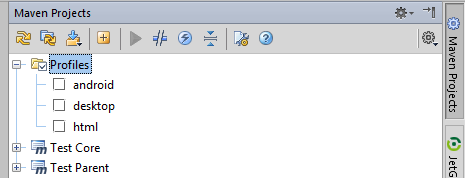
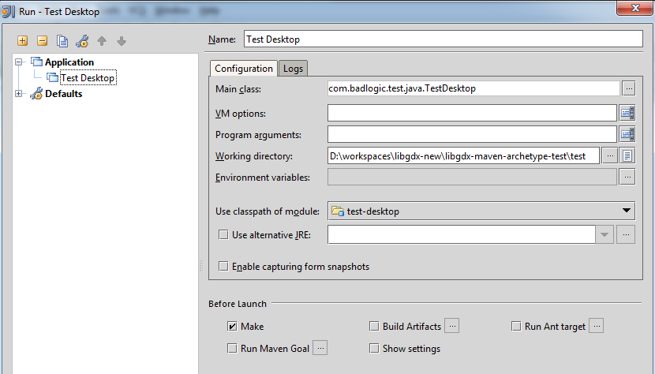
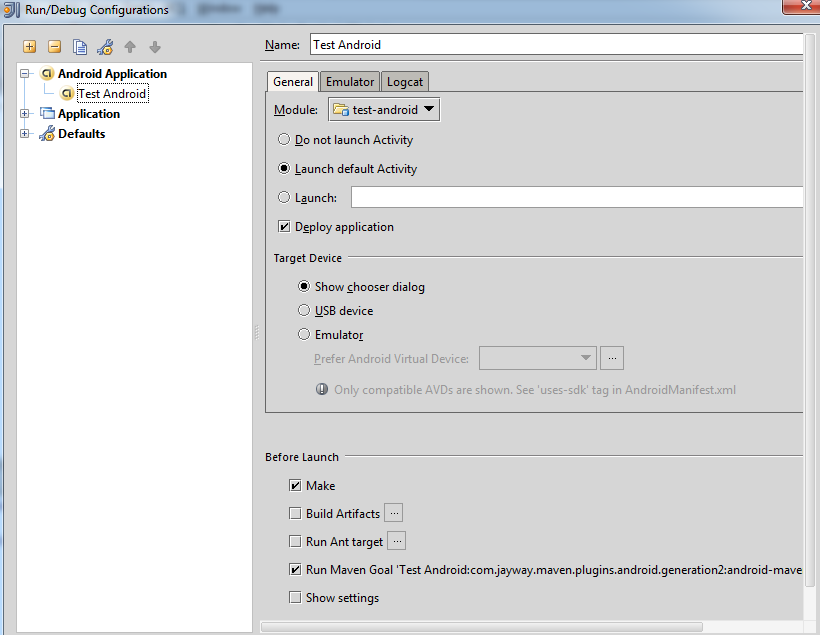

# LibGDX на Maven шаблон
[Ссылка на источник](https://libgdx.com/wiki/articles/maven-integration#introduction)

### Текущий инструмент автоматической установки LibGDX настраивает проект Gradle, поэтому, чтобы настроить Maven только для рабочего стола, просто добавьте следующие зависимости в pom.xml вашего проекта:

```
<dependency>
    <groupId>com.badlogicgames.gdx</groupId>
    <artifactId>gdx</artifactId>
    <version>1.12.1</version>
</dependency>
<dependency>
    <groupId>com.badlogicgames.gdx</groupId>
    <artifactId>gdx-backend-lwjgl3</artifactId>
    <version>1.12.1</version>
</dependency>
<dependency>
    <groupId>com.badlogicgames.gdx</groupId>
    <artifactId>gdx-platform</artifactId>
    <version>1.12.1</version>
    <classifier>natives-desktop</classifier>
</dependency>`
```
И у вас есть все необходимое для запуска Lwjgl3Application, предоставляющего собственную реализацию ApplicationAdapter.

Альтернативно, более старый метод, описанный ниже, может обеспечить некоторую кроссплатформенность, но на этом этапе вам, возможно, повезет, если вы смените систему сборки на Gradle.

## Использование архетипа

### Настройка libGDX в целом нетривиальна, поскольку:
* содержит собственные библиотеки
* развертывается в GWT
* развертывается на Android

### Для решения этих проблем libGDX использует следующие плагины Maven:

* Плагин GWT Maven, версия 2.5.0 , для компиляции и упаковки проекта GWT.
* Плагин собственных зависимостей Maven для копирования собственных библиотек в подходящее место.
* Плагин Maven Android , для компиляции и упаковки проекта Android.

_Чтобы упростить все это, мы предоставляем архетип Maven, который будет генерировать многомодульный проект Maven._

### Архетип Maven
Архетип Maven на данный момент не найден ни в одном репозитории. 
Вы можете получить его по [адресу](https://github.com/libgdx/libgdx-maven-archetype) 

Скомпилировать и установить его самостоятельно в свой локальный репозиторий Maven, например, из своей оболочки:
```
git clone git://github.com/libgdx/libgdx-maven-archetype.git
cd libgdx-maven-archetype
mvn install
Чтобы вызвать архетип, сделайте следующее:
```
```
mvn archetype:generate -DarchetypeGroupId=com.badlogic.gdx -DarchetypeArtifactId=gdx-archetype -DarchetypeVersion=1.2.0 -DgroupId=com.badlogic.test -DartifactId=test -Dversion=1.0-SNAPSHOT -Dpackage=com.badlogic.test -DJavaGameClassName=Test
```
Первые три параметра определяют архетип, который имеет идентификатор группы com.badlogic.gdx, идентификатор артефакта gdx-archetype и версию (в настоящее время 1.0-SNAPSHOT).

Следующие параметры определяют атрибуты вашего проекта:
* groupId: идентификатор группы вашего проекта.
* artefectId: идентификатор артефакта вашего проекта.
* version: версия вашего проекта
* package: основной пакет вашего проекта
* JavaGameClassName: имя вашего класса ApplicationListener и префикс для начальных классов платформы, например MyClassDesktop, MyClassAndroid и т. д.

Для параметров, указанных выше, вы получите следующую структуру проекта (мы будем использовать этот пример в последующих разделах):
```
test/       <-- the base directory
core/    <-- contains the apps core
desktop/ <-- desktop starter & assets
android/ <-- android starter
html/    <-- HTML starter
ios/     <- stub, not working at the moment
Основной проект содержит код вашего приложения. Проект рабочего стола содержит папку ресурсов, которая является общей для всех других проектов и начального класса рабочего стола. Проект Android содержит стартовый код Android и зависит от основного проекта. То же самое справедливо и для проекта HTML. Проект iOS в настоящее время является заглушкой и пока не работает.
```
### Создание и развертывание
Использовать Maven для создания и развертывания приложения для различных серверных частей очень просто.

### Desktop
Чтобы создать работоспособный jar-файл для рабочего стола, запустите:
```
mvn -Pdesktop package
```
Это создаст файл с именем template-desktop-1.0.0-jar-with-dependencies.jar в папке template/desktop/target.
Он содержит все необходимые зависимости, ресурсы и файл манифеста, определяющий основной класс. 
Вы можете запустить этот файл через:
```
java -jar template-desktop-1.0.0-jar-with-dependencies.jar
```
### Android
Чтобы создать неподписанный APK для Android, запустите:
```
mvn -Pandroid package
```
Это создаст файл с именем test-android-1.0-SNAPSHOT.apk в папке test/android/target. 
Чтобы установить APK на подключенное устройство или эмулятор, запустите
```
mvn -Pandroid install
```
Дополнительную информацию о целях Android см. в [плагине Maven для Android](https://simpligility.github.io/android-maven-plugin/).

### HTML5/GWT
Чтобы скомпилировать проект HTML5 в JavaScript, запустите:
```
mvn -Phtml package
```
Конечный результат находится в папке target/. Вы можете либо использовать созданный файл .war и развернуть его в Jetty/Tomcat, либо скопировать содержимое папки HTML/target/webapp/ в место, где ваш веб-сервер может обслуживать (или даже лучше). , создайте символическую ссылку, если вы используете соответствующую ОС). War/папка содержит весь скомпилированный код JavaScript, индексный HTML-файл и ресурсы.

Чтобы запустить и протестировать проект HTML5, запустите:
```
mvn -Phtml install
```
И перейдите по адресу [http://127.0.0.1:8080/index.html](http://127.0.0.1:8080/index.html)

## IDE-интеграция
Eclipse, IntelliJ IDEA и NetBeans в той или иной форме поддерживают проекты Maven. Архетип делает все возможное, чтобы ваш проект libGDX можно было использовать в Eclipse и IntelliJ IDEA. NetBeans на момент написания не поддерживается.

Хотя Maven не зависит от IDE, плагины для GWT и Android — нет. Плагины для Eclipse отличаются тем, как интерпретируются конфигурации Maven для проектов GWT и Android, от конфигураций в IntelliJ IDEA. В следующих разделах описывается, как импортировать проект в обе IDE после его создания с использованием архетипа libGDX.

### Eclipse
Прежде чем вы сможете импортировать свой проект, вам необходимо установить следующие плагины Eclipse:
* m2e , это уже должно быть доступно в чистой установке Eclipse (выпуски Java и Java EE). Он обеспечивает базовую поддержку Maven в Eclipse.
* m2e-android обеспечивает интеграцию Maven для проектов Android в Eclipse.
* Google Web Toolkit — плагин Eclipse, позволяющий разрабатывать GWT-проекты.
После установки плагинов вы можете импортировать свои проекты Maven libGDX, выбрав _File -> Import… -> Maven -> Existing Maven Projects_ Это импортирует родительский pom как проект вместе с проектом ядра, рабочего стола, Android и html.

Обратите внимание, что проект HTML может не распознаваться Eclipse как проект GWT. Чтобы это исправить, щелкните проект правой кнопкой мыши и выберите _Properties -> Google -> Web Toolkit_ Установите флажок «Использовать Google Web Toolkit». Затем перейдите в «Свойства» -> «Google» -> «Веб-приложение» , отметьте «У этого проекта есть каталог WAR», укажите target/webappи, наконец, установите флажок «Запускать и развертывать из этого каталога».

После этого вы можете запускать и отлаживать так же, как если бы вы настраивали свои проекты через gdx-setup-ui.

Если вы измените что-либо в ресурсах, вам нужно снова запустить «mvn -Phtml package» и обновить html-проект в Eclipse.

### IntelliJ IDEA
Прежде чем начать, вы должны убедиться, что IntelliJ IDEA знает, где находится ваша установка Maven. Перейдите в _File -> Settings_ и в дереве в диалоге выберите Maven. Укажите каталог, в котором находится ваша установка Maven.

После того, как вы создали свой проект с помощью архетипа, вы можете импортировать его в IntelliJ IDEA. Перейдите в _File -> Open Project_, затем перейдите в корневой каталог проекта.

После загрузки проекта вам необходимо включить профили. Откройте представление проекта Maven и проверьте три профиля: рабочий стол, Android и HTML.



Чтобы запустить проект рабочего стола, создайте новую конфигурацию через _Run -> Edit Configurations_. Создайте новую конфигурацию, нажав кнопку + в левом верхнем углу и выберите Приложение. Установите для основного класса начальный класс рабочего стола и выберите модуль рабочего стола.



Запустите эту конфигурацию, чтобы запустить приложение на рабочем столе.

Чтобы запустить проект Android, создайте новую конфигурацию, на этот раз выбрав Приложение Android при создании конфигурации. Выберите модуль Android, затем установите флажок «Запустить цель Maven» и нажмите кнопку … справа. В диалоге выберите проект Android, затем Lifecycle и из списка целей пакет . Вы также можете настроить целевое устройство на «Показать диалоговое окно выбора» , чтобы вам было предложено выполнить развертывание на устройстве или в эмуляторе.



Запустите эту конфигурацию, чтобы запустить приложение на устройстве Android или в эмуляторе.